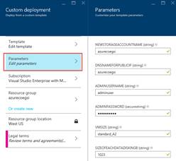
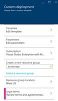
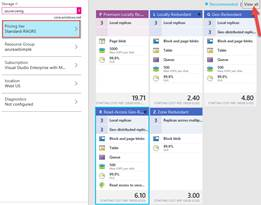
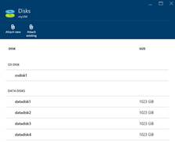
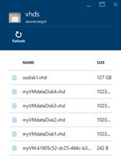
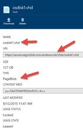
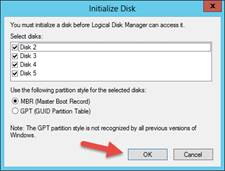
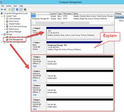
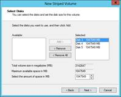
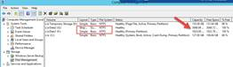

# Demo - Azure Storage Introduction

This guide provides an introduction to some basic Azure Storage concepts.  In this demonstration you will show how to 
*	Create an Azure storage account using the Azure portal.
*	Describe the replication options such as LRS, ZRS and (RA-)GRS.
*	Show how and where Virtual Machine disks are persisted in an Azure Storage Account.
*	Demonstrate that within the virtual machine instance, the disks (VHDs) in the Azure Storage account look and feel just like a disk you�re used to working with in an on-premises or virtualized environment.
*	Explain the temporary storage on D: and point out that it doesn�t exist in your Azure storage account.
*	Show how to create a new simple volume.
*	Show how to create a new striped volume.

#### Pre-Requisites
This section lists the pre-requisites required for this demonstration.
*	Azure subscription

#### Setup
Estimated time: 15 minutes

1.  Open a browser and navigate to <https://github.com/Azure/azure-quickstart-templates/tree/master/101-vm-multiple-data-disk>. This is an ARM template that will deploy a VM with 4 data disks attached to the VM.
2.	Click the Deploy to Azure button.
3.	In the Custom deployment blade, click on Parameters.  Fill in the parameters as shown.  Note: you will need to come up with a unique name of your own for the storage account name and DNS name. For the VM Size use Standard_A2 and for the data disk size enter 1023.

4.	Click on Resource group and create a new resource group.
5.	Click Legal Terms and accept the terms.
6.	Click the Create button.

7.	RDP into the virtual machine. 
8.	Open a Command Prompt as an Administrator.
9.	Type the following commands to online the 4 data disks.
  a. `DISKPART <ENTER>`
  b. `LIST DISK <ENTER>` This will list all the disks.  The 4 data disks should be disks 2 through 5.
  c. `SELECT DISK 2 <ENTER>`
  d. `ATTRIBUTE DISK CLEAR READONLY <ENTER>`
  e. `ONLINE DISK <ENTER>` Repeat steps b through d for disk 3, 4, and 5.
10.	Download DiskSpd from <https://gallery.technet.microsoft.com/DiskSpd-a-robust-storage-6cd2f223>. This is one of the tools the Azure Storage team recommends using to perform storage benchmark tests. Alternatively, the tool is provided as part of the demo script folder.
11.	Unzip DiskSpd to C:\Temp\DiskSpd.

#### Demo Steps
Estimated time: 8 minutes

1.	Sign-in to the Azure portal.
2.	**NEW > Data + Storage + Storage Account**.
3.	Enter a storage account name (remember lower case letters only).
4.	Click on Pricing tier.
a.	Explain briefly the concept of LRS and GRS.  Then point out GRS w/RA.  Point out that Premium Storage is only for page blobs (Virtual Machine disks) and only available as LRS. Point out the ZRS is only for block blobs.
5.	Click on Resource Group.
a.	Select the resource group for the Virtual Machine and storage account created in the setup section.
6.	Click on Diagnostics.  Explain this is where you can enable diagnostics for the storage account.
7.	In the Storage account blade click the Create button.  Don�t wait for the account to be created.  Move on to the next step.

8.	Go to the Resource group blade.
9.	Click on the Virtual Machine in the Summary part.
10.	In the Virtual Machine blade, click on Settings in the toolbar.
11.	Click on Disks.
12.	In the Disks blade show the OS Disk and the 4 data disks attached to the Virtual Machine.

13.	In the Blobs blade, click on the vhds container.
14.	In the container blade, show the OS disk and 4 data disks you referenced earlier in the attached disks for the virtual machine.
15.	Some things to point out are:
  a. The OS disk is 127 GB.
  b. The data disks can be any size up to 1TB.  These are all 1TB data drives.
  c. The last VHD is a status blob file used by Azure.

16.	Click on the OS Disk.
17.	In the OS Disk blade, point out the following:
  a. The addressable URL for the disk.
  b. The type of blob, which is Page Blob.  Reiterate that page blobs are optimized for random I/O and are used to back Virtual Machine disks.
18.	Go back to the vhds blade.
19.	Click on one of the data disks.  Point out that these are simply page blobs as well.

20.	Go back to the Virtual Machine blade.
21.	Click the Connect button in the toolbar.
22.	Sign-in to the Virtual Machine.
23.	In the Server Manager Dashboard, click Tools > Computer Management.
24.	Click on Disk Management.
25.	In the Initialize Disk dialog, click OK to initialize the 4 data disks.

26.	In the Disk Management window:
  a.	Show the C: (127 BG) which is the OS Disk backed in the Azure storage account.
  b.	Show the 4 data disks unallocated and ready to be configured.  Explain that you can create 4 separate volumes and logical drives for each, or you could stripe them and create one 4TB volume.
  c.	Explain the D: drive.  This is backed by physical disks in the rack the virtual machine is running on.  Hence the reason it is temporary � it is not persisted (or backed) by your Azure Storage Account.  So only store temporary data here you are OK with losing.
27.	Right-click on Disk 2 and select New Simple Volume.  Accept all the defaults to complete the wizard except for the following:
  a.	Set the drive letter to F.
  b.	Set the Volume label to �Data1�.
28.	Check the box to do a Quick Format.

29.	Right-click on Disk 3 and select New Striped Volume.
30.	Accept all the defaults to complete the wizard except for the following:
a.	Add Disk 4 and Disk 5 to the selected disks that will comprise the volume.
  b.	Set the drive letter to G.
  c.	Set the Volume label to �Data2�.
  d.	Check the box to do a Quick Format.

31.	At the top of the Disk Management window show the two volumes.  Point out the sizes of 1TB and 3TB, Simple and Striped.

#### Clean Up
To clean up this environment, delete the resource group which you created in the Setup section.
