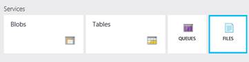
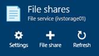
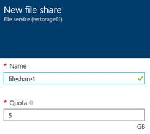
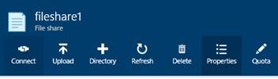
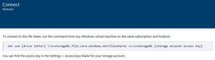
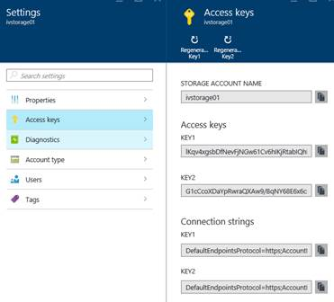

# Demo - Azure File Storage

This guide demonstrates how to create and use Azure file shares.

#### Pre-Requisites
This section lists the pre-requisites required for this demonstration.
* Azure subscription
* Visual Studio 2013 or 2015
* Ensure you have a created a storage account

#### Setup
Estimated time: 0 minutes

No particular setup required.

#### Demo Steps
Estimated time: 5 minutes

1. Navigate to the Azure portal
2. Go to a resource group with a storage account provisioned. If it does not exist create one
3. Select Files to expose the File Shares blade 

4. Click on new File Share to create a new share 

5. Enter a name for the file share. Expain that you can set a quota on the share, similar to an NTFS file share. The File Share can be a maximum of 5 TB. 

6. Click create
7. Select the file share you just created and click on the connect button 

8. This will expose a new blade with the net use statement to mount the new share 

9. Copy the net use path to the clipboard and paste it into a new notepad Window
10. Navigate to the settings of the storage account to view the access keys 

11. Copy the access key for the storage account to the clip board and paste it into notepad
12. Open Windows Explorer on your local client or in a VM
13. Open a command line window
14. Edit the net use statement by adding a drive letter that is not in use on your local machine.
`NET USE <DRIVE>: \\<ACCOUNTNAME>.file.core.windows.net\<SHARENAME> /u:<ACCOUNTNAME> <STORAGEKEY> `
15.	Copy and Paste the net use statement into the command line and press enter
16. This should mount the new Azure file share to your local machine
17.	Enter the drive letter: and click enter
18.	Create a new directory with the MD command
19.	Navigate to the portal to view the new folder
20.	In the portal, you can also upload a few files and view them locally
21.	Point out that in a VM, you can share the storage across VMs. File shares are accessible through Windows Explorer. NOTE: It may not work from local/on-premises machines due to network restrictions (firewall), i.e. if ports required for SMB are blocked. It works well though from VM hosted in Azure.

#### Clean Up
To clean up this environment perform the following steps:
1.	Delete the storage account you created.
2.	Run `NET USE <DRIVE>: DELETE` to remove the mapping

