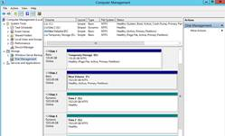
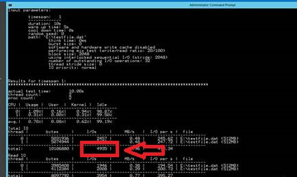
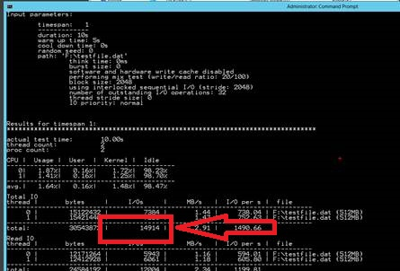

# Demo - Storage Disk IOPS

This guide demonstrates the IOPS achieved on a single data disk as well as a striped volume comprised of 3 data disks.  In this demonstration you will show how to 
* Perform a benchmark test to show the IOPS capable.

#### Pre-Requisites
This section lists the pre-requisites required for this demonstration.
* Azure subscription
* Virtual Machine with 4 disk, configured as described in [Demo 1](../Demo%201%20-%20Storage%20Introduction/Readme.md)

#### Setup
Estimated time: None.  
If you setup and presented [Demo 1](../Demo%201%20-%20Storage%20Introduction/Readme.md) then you are ready to present this demo. Otherwise, complete [Demo 1](../Demo%201%20-%20Storage%20Introduction/Readme.md) first.

#### Demo Steps
Estimated time: 5 minutes

1. RDP into the virtual machine you used in [Demo 1](../Demo%201%20-%20Storage%20Introduction/Readme.md) then you are ready to present this demo. Otherwise, complete [Demo 1](../Demo%201%20-%20Storage%20Introduction/Readme.md).
2. Revisit the Disk Management screen to show the two drive configurations ( F: and G: ).  

3. Open a CMD prompt window.
4. Change directories to C:\Temp\Diskspd (or where you placed DiskSpd in Demo 1)
5. Run the following commands: 
  a. `diskspd -c2G -b2K -w20 -F8 -o32 -d10 -h F:\testfile.dat` 
  b. While this is running explain the test you are performing.  The test is an IO benchmark test against drive F: (the single 1TB drive).  The test is performing a R/W test using the SQLIO benchmarking test tool.  This is a tool that the Azure Storage team recommends using to benchmark storage. The test is running for 20 seconds (-s parameter). 
  c. When the test is done, point out the IOPS which should be ~500.  Reiterating that the IOPS per data disk is 500 IOPS. 
  d. You need to point to the Total I/Os. 

6. Run the following commands: 
  a. `diskspd -c2G -b2K -w20 -F8 -o32 -d10 -h G:\testfile.dat` 
  b. When the test is done, point out the IOPS which should be ~1500. Reiterating that the IOPS per data disk is 500 IOPS. 
  c. You need to point to the Total I/Os. 

 

#### Clean Up
To clean up this environment delete the resource group you created in the Setup section.
