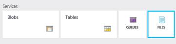

<html>

<head>
<meta http-equiv=Content-Type content="text/html; charset=windows-1252">
<meta name=Generator content="Microsoft Word 15 (filtered)">

</head>

<body lang=EN-US link="#0563C1" vlink="#954F72">

Storage Azure File Shares

This guide demonstrates how to create and use Azure file
shares.

Contents

<a href="#_Toc430940223">Pre-Requisites. 1</a>

<a href="#_Toc430940224">Setup. 1</a>

<a href="#_Toc430940225">Demo Steps. 2</a>

<a href="#_Toc430940226">Clean Up. 3</a>

&nbsp;

&nbsp;

<h2><a name="_Toc430940223">Pre-Requisites</a></h2>

This section lists the pre-requisites required for this
demonstration.

·&nbsp;&nbsp;&nbsp;&nbsp;&nbsp;&nbsp;&nbsp;&nbsp;
Azure subscription

·&nbsp;&nbsp;&nbsp;&nbsp;&nbsp;&nbsp;&nbsp;&nbsp;
Visual Studio 2013 or 2015

·&nbsp;&nbsp;&nbsp;&nbsp;&nbsp;&nbsp;&nbsp;&nbsp;
Ensure you have a created a storage account

<h2><a name="_Toc430940224">Setup</a></h2>

Estimated time: 5 minutes

&nbsp;

<h2><a name="_Toc427562303">Demo Steps</a></h2>

Estimated time: 5 mins

&nbsp;

<table class=MsoTableGrid border=1 cellspacing=0 cellpadding=0
 style='border-collapse:collapse;border:none'>
 <tr>
  <td width=390 valign=top style='width:292.25pt;border:solid windowtext 1.0pt;
  padding:0in 5.4pt 0in 5.4pt'>
  <ol style='margin-top:0in' start=1 type=1>
   <li class=MsoNormal style='margin-bottom:0in;margin-bottom:.0001pt;
       line-height:normal'>Navigate to the Azure portal</li>
  </ol>
  </td>
  <td width=330 valign=top style='width:247.25pt;border:solid windowtext 1.0pt;
  border-left:none;padding:0in 5.4pt 0in 5.4pt'>
  
&nbsp;

  </td>
 </tr>
 <tr>
  <td width=390 valign=top style='width:292.25pt;border:solid windowtext 1.0pt;
  border-top:none;padding:0in 5.4pt 0in 5.4pt'>
  <ol style='margin-top:0in' start=2 type=1>
   <li class=MsoNormal style='margin-bottom:0in;margin-bottom:.0001pt;
       line-height:normal'>Go to a resource group with a storage account
       provisioned. If it does not exist create one</li>
  </ol>
  </td>
  <td width=330 valign=top style='width:247.25pt;border-top:none;border-left:
  none;border-bottom:solid windowtext 1.0pt;border-right:solid windowtext 1.0pt;
  padding:0in 5.4pt 0in 5.4pt'>
  
&nbsp;

  </td>
 </tr>
 <tr>
  <td width=390 valign=top style='width:292.25pt;border:solid windowtext 1.0pt;
  border-top:none;padding:0in 5.4pt 0in 5.4pt'>
  <ol style='margin-top:0in' start=3 type=1>
   <li class=MsoNormal style='margin-bottom:0in;margin-bottom:.0001pt;
       line-height:normal'>Select Files to expose the File Shares blade</li>
  </ol>
  </td>
  <td width=330 valign=top style='width:247.25pt;border-top:none;border-left:
  none;border-bottom:solid windowtext 1.0pt;border-right:solid windowtext 1.0pt;
  padding:0in 5.4pt 0in 5.4pt'>
  

  </td>
 </tr>
 <tr>
  <td width=390 valign=top style='width:292.25pt;border:solid windowtext 1.0pt;
  border-top:none;padding:0in 5.4pt 0in 5.4pt'>
  <ol style='margin-top:0in' start=4 type=1>
   <li class=MsoNormal style='margin-bottom:0in;margin-bottom:.0001pt;
       line-height:normal'>Click on new File Share to create a new share</li>
  </ol>
  </td>
  <td width=330 valign=top style='width:247.25pt;border-top:none;border-left:
  none;border-bottom:solid windowtext 1.0pt;border-right:solid windowtext 1.0pt;
  padding:0in 5.4pt 0in 5.4pt'>
  

  </td>
 </tr>
 <tr>
  <td width=390 valign=top style='width:292.25pt;border:solid windowtext 1.0pt;
  border-top:none;padding:0in 5.4pt 0in 5.4pt'>
  <ol style='margin-top:0in' start=5 type=1>
   <li class=MsoNormal style='margin-bottom:0in;margin-bottom:.0001pt;
       line-height:normal'>Enter a name for the file share. Expain that you can
       set a quota on the share, similar to an NTFS file share. The File Share
       can be a maximum of 5 TB.</li>
  </ol>
  </td>
  <td width=330 valign=top style='width:247.25pt;border-top:none;border-left:
  none;border-bottom:solid windowtext 1.0pt;border-right:solid windowtext 1.0pt;
  padding:0in 5.4pt 0in 5.4pt'>
  

  </td>
 </tr>
 <tr>
  <td width=390 valign=top style='width:292.25pt;border:solid windowtext 1.0pt;
  border-top:none;padding:0in 5.4pt 0in 5.4pt'>
  <ol style='margin-top:0in' start=6 type=1>
   <li class=MsoNormal style='margin-bottom:0in;margin-bottom:.0001pt;
       line-height:normal'>Click create</li>
  </ol>
  </td>
  <td width=330 valign=top style='width:247.25pt;border-top:none;border-left:
  none;border-bottom:solid windowtext 1.0pt;border-right:solid windowtext 1.0pt;
  padding:0in 5.4pt 0in 5.4pt'>
  
&nbsp;

  </td>
 </tr>
 <tr>
  <td width=390 valign=top style='width:292.25pt;border:solid windowtext 1.0pt;
  border-top:none;padding:0in 5.4pt 0in 5.4pt'>
  <ol style='margin-top:0in' start=7 type=1>
   <li class=MsoNormal style='margin-bottom:0in;margin-bottom:.0001pt;
       line-height:normal'>Select the file share you just created and click on
       the connect button</li>
  </ol>
  </td>
  <td width=330 valign=top style='width:247.25pt;border-top:none;border-left:
  none;border-bottom:solid windowtext 1.0pt;border-right:solid windowtext 1.0pt;
  padding:0in 5.4pt 0in 5.4pt'>
  

  </td>
 </tr>
 <tr>
  <td width=390 valign=top style='width:292.25pt;border:solid windowtext 1.0pt;
  border-top:none;padding:0in 5.4pt 0in 5.4pt'>
  <ol style='margin-top:0in' start=8 type=1>
   <li class=MsoNormal style='margin-bottom:0in;margin-bottom:.0001pt;
       line-height:normal'>This will expose a new blade with the net use
       statement to mount the new share</li>
  </ol>
  </td>
  <td width=330 valign=top style='width:247.25pt;border-top:none;border-left:
  none;border-bottom:solid windowtext 1.0pt;border-right:solid windowtext 1.0pt;
  padding:0in 5.4pt 0in 5.4pt'>
  

  </td>
 </tr>
 <tr>
  <td width=390 valign=top style='width:292.25pt;border:solid windowtext 1.0pt;
  border-top:none;padding:0in 5.4pt 0in 5.4pt'>
  <ol style='margin-top:0in' start=9 type=1>
   <li class=MsoNormal style='margin-bottom:0in;margin-bottom:.0001pt;
       line-height:normal'>Copy the net use path to the clipboard and paste it
       into a new notepad Window</li>
  </ol>
  </td>
  <td width=330 valign=top style='width:247.25pt;border-top:none;border-left:
  none;border-bottom:solid windowtext 1.0pt;border-right:solid windowtext 1.0pt;
  padding:0in 5.4pt 0in 5.4pt'>
  
&nbsp;

  </td>
 </tr>
 <tr>
  <td width=390 valign=top style='width:292.25pt;border:solid windowtext 1.0pt;
  border-top:none;padding:0in 5.4pt 0in 5.4pt'>
  <ol style='margin-top:0in' start=10 type=1>
   <li class=MsoNormal style='margin-bottom:0in;margin-bottom:.0001pt;
       line-height:normal'>Navigate to the settings of the storage account to
       view the access keys</li>
  </ol>
  </td>
  <td width=330 valign=top style='width:247.25pt;border-top:none;border-left:
  none;border-bottom:solid windowtext 1.0pt;border-right:solid windowtext 1.0pt;
  padding:0in 5.4pt 0in 5.4pt'>
  

  </td>
 </tr>
 <tr>
  <td width=390 valign=top style='width:292.25pt;border:solid windowtext 1.0pt;
  border-top:none;padding:0in 5.4pt 0in 5.4pt'>
  <ol style='margin-top:0in' start=11 type=1>
   <li class=MsoNormal style='margin-bottom:0in;margin-bottom:.0001pt;
       line-height:normal'>Copy the access key for the storage account to the
       clip board and paste it into notepad</li>
  </ol>
  </td>
  <td width=330 valign=top style='width:247.25pt;border-top:none;border-left:
  none;border-bottom:solid windowtext 1.0pt;border-right:solid windowtext 1.0pt;
  padding:0in 5.4pt 0in 5.4pt'>
  
&nbsp;

  </td>
 </tr>
 <tr>
  <td width=390 valign=top style='width:292.25pt;border:solid windowtext 1.0pt;
  border-top:none;padding:0in 5.4pt 0in 5.4pt'>
  <ol style='margin-top:0in' start=12 type=1>
   <li class=MsoNormal style='margin-bottom:0in;margin-bottom:.0001pt;
       line-height:normal'>Open Windows Explorer on your local client or in a
       VM</li>
  </ol>
  </td>
  <td width=330 valign=top style='width:247.25pt;border-top:none;border-left:
  none;border-bottom:solid windowtext 1.0pt;border-right:solid windowtext 1.0pt;
  padding:0in 5.4pt 0in 5.4pt'>
  
&nbsp;

  </td>
 </tr>
 <tr>
  <td width=390 valign=top style='width:292.25pt;border:solid windowtext 1.0pt;
  border-top:none;padding:0in 5.4pt 0in 5.4pt'>
  <ol style='margin-top:0in' start=13 type=1>
   <li class=MsoNormal style='margin-bottom:0in;margin-bottom:.0001pt;
       line-height:normal'>Open a command line window</li>
  </ol>
  </td>
  <td width=330 valign=top style='width:247.25pt;border-top:none;border-left:
  none;border-bottom:solid windowtext 1.0pt;border-right:solid windowtext 1.0pt;
  padding:0in 5.4pt 0in 5.4pt'>
  
&nbsp;

  </td>
 </tr>
 <tr>
  <td width=390 valign=top style='width:292.25pt;border:solid windowtext 1.0pt;
  border-top:none;padding:0in 5.4pt 0in 5.4pt'>
  <ol style='margin-top:0in' start=14 type=1>
   <li class=MsoNormal style='margin-bottom:0in;margin-bottom:.0001pt;
       line-height:normal'>Edit the net use statement by adding a drive letter
       that is not in use on your local machine.</li>
  </ol>
  </td>
  <td width=330 valign=top style='width:247.25pt;border-top:none;border-left:
  none;border-bottom:solid windowtext 1.0pt;border-right:solid windowtext 1.0pt;
  padding:0in 5.4pt 0in 5.4pt'>
  
net use DRIVE: \\ACCOUNTNAME.file.core.windows.net\SHARENAME/u:ivstorage01
  &quot;&lt;&lt;STORAGEKEY&gt;&gt;&quot;

  </td>
 </tr>
 <tr>
  <td width=390 valign=top style='width:292.25pt;border:solid windowtext 1.0pt;
  border-top:none;padding:0in 5.4pt 0in 5.4pt'>
  <ol style='margin-top:0in' start=15 type=1>
   <li class=MsoNormal style='margin-bottom:0in;margin-bottom:.0001pt;
       line-height:normal'>Copy and Paste the net use statement into the
       command line and press enter</li>
  </ol>
  </td>
  <td width=330 valign=top style='width:247.25pt;border-top:none;border-left:
  none;border-bottom:solid windowtext 1.0pt;border-right:solid windowtext 1.0pt;
  padding:0in 5.4pt 0in 5.4pt'>
  
&nbsp;

  </td>
 </tr>
 <tr>
  <td width=390 valign=top style='width:292.25pt;border:solid windowtext 1.0pt;
  border-top:none;padding:0in 5.4pt 0in 5.4pt'>
  <ol style='margin-top:0in' start=16 type=1>
   <li class=MsoNormal style='margin-bottom:0in;margin-bottom:.0001pt;
       line-height:normal'>This should mount the new Azure file share to your
       local machine</li>
  </ol>
  </td>
  <td width=330 valign=top style='width:247.25pt;border-top:none;border-left:
  none;border-bottom:solid windowtext 1.0pt;border-right:solid windowtext 1.0pt;
  padding:0in 5.4pt 0in 5.4pt'>
  
&nbsp;

  </td>
 </tr>
 <tr>
  <td width=390 valign=top style='width:292.25pt;border:solid windowtext 1.0pt;
  border-top:none;padding:0in 5.4pt 0in 5.4pt'>
  <ol style='margin-top:0in' start=17 type=1>
   <li class=MsoNormal style='margin-bottom:0in;margin-bottom:.0001pt;
       line-height:normal'>Enter the drive letter: and click enter</li>
  </ol>
  </td>
  <td width=330 valign=top style='width:247.25pt;border-top:none;border-left:
  none;border-bottom:solid windowtext 1.0pt;border-right:solid windowtext 1.0pt;
  padding:0in 5.4pt 0in 5.4pt'>
  
&nbsp;

  </td>
 </tr>
 <tr>
  <td width=390 valign=top style='width:292.25pt;border:solid windowtext 1.0pt;
  border-top:none;padding:0in 5.4pt 0in 5.4pt'>
  <ol style='margin-top:0in' start=18 type=1>
   <li class=MsoNormal style='margin-bottom:0in;margin-bottom:.0001pt;
       line-height:normal'>Create a new directory with the MD command</li>
  </ol>
  </td>
  <td width=330 valign=top style='width:247.25pt;border-top:none;border-left:
  none;border-bottom:solid windowtext 1.0pt;border-right:solid windowtext 1.0pt;
  padding:0in 5.4pt 0in 5.4pt'>
  
&nbsp;

  </td>
 </tr>
 <tr>
  <td width=390 valign=top style='width:292.25pt;border:solid windowtext 1.0pt;
  border-top:none;padding:0in 5.4pt 0in 5.4pt'>
  <ol style='margin-top:0in' start=19 type=1>
   <li class=MsoNormal style='margin-bottom:0in;margin-bottom:.0001pt;
       line-height:normal'>Navigate to the portal to view the new folder</li>
  </ol>
  </td>
  <td width=330 valign=top style='width:247.25pt;border-top:none;border-left:
  none;border-bottom:solid windowtext 1.0pt;border-right:solid windowtext 1.0pt;
  padding:0in 5.4pt 0in 5.4pt'>
  
&nbsp;

  </td>
 </tr>
 <tr>
  <td width=390 valign=top style='width:292.25pt;border:solid windowtext 1.0pt;
  border-top:none;padding:0in 5.4pt 0in 5.4pt'>
  <ol style='margin-top:0in' start=20 type=1>
   <li class=MsoNormal style='margin-bottom:0in;margin-bottom:.0001pt;
       line-height:normal'>In the portal, you can also upload a few files and
       view them locally</li>
  </ol>
  </td>
  <td width=330 valign=top style='width:247.25pt;border-top:none;border-left:
  none;border-bottom:solid windowtext 1.0pt;border-right:solid windowtext 1.0pt;
  padding:0in 5.4pt 0in 5.4pt'>
  
&nbsp;

  </td>
 </tr>
 <tr>
  <td width=390 valign=top style='width:292.25pt;border:solid windowtext 1.0pt;
  border-top:none;padding:0in 5.4pt 0in 5.4pt'>
  <ol style='margin-top:0in' start=21 type=1>
   <li class=MsoNormal style='margin-bottom:0in;margin-bottom:.0001pt;
       line-height:normal'>Point out that in a VM, you can share the storage
       across VMs. <b><i><s>NOTE: You will not be able to navigate the new file
       share using Windows Explorer, only the command line and POSH. </s></i></b>File
       shares are accessible through Windows Explorer. However it may not work
       from local machines due to network limitations (firewall), ie in all
       MSFT offices required ports for SMB are blocked. It works well though
       from VM hosted in Azure.</li>
  </ol>
  </td>
  <td width=330 valign=top style='width:247.25pt;border-top:none;border-left:
  none;border-bottom:solid windowtext 1.0pt;border-right:solid windowtext 1.0pt;
  padding:0in 5.4pt 0in 5.4pt'>
  
&nbsp;

  </td>
 </tr>
</table>

&nbsp;

<h2><a name="_Toc430940226">Clean Up</a></h2>

To clean up this environment perform the following steps:

1.&nbsp;&nbsp;&nbsp;&nbsp;&nbsp;&nbsp; Delete
the storage account you created.

2.&nbsp;&nbsp;&nbsp;&nbsp;&nbsp;&nbsp; Run
net use DRIVE: DELETE to remove the mapping

</body>

</html>
