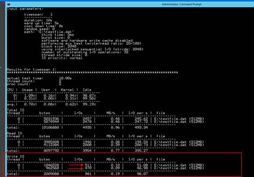
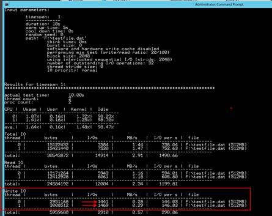

<html>

<head>
<meta http-equiv=Content-Type content="text/html; charset=windows-1252">
<meta name=Generator content="Microsoft Word 15 (filtered)">

</head>

<body lang=EN-US link="#0563C1" vlink="#954F72">

Storage Disk IOPS

This guide demonstrates the IOPS achieved on a single data
disk as well as a striped volume comprised of 3 data disks.  In this demonstration
you will show how to 

·&nbsp;&nbsp;&nbsp;&nbsp;&nbsp;&nbsp;&nbsp;&nbsp;
Perform a benchmark test to show the IOPS capable.

Contents

<a href="#_Toc427306736">Pre-Requisites. 1</a>

<a href="#_Toc427306737">Setup. 1</a>

<a href="#_Toc427306738">Demo Steps. 1</a>

<a href="#_Toc427306739">Clean Up. 2</a>

&nbsp;

&nbsp;

<h2><a name="_Toc427306736">Pre-Requisites</a></h2>

This section lists the pre-requisites required for this
demonstration.

·&nbsp;&nbsp;&nbsp;&nbsp;&nbsp;&nbsp;&nbsp;&nbsp;
Azure subscription

<h2><a name="_Toc427306737">Setup</a></h2>

Estimated time: None.  If you
setup demo 1 and presented demo 1 then you are ready to present this demo.  
Otherwise, complete demo 1 first.

<h2><a name="_Toc427306738">Demo Steps</a></h2>

Estimated time: 5 mins

<table class=MsoTableGrid border=1 cellspacing=0 cellpadding=0
 style='border-collapse:collapse;border:none'>
 <tr>
  <td width=444 valign=top style='width:332.75pt;border:solid windowtext 1.0pt;
  padding:0in 5.4pt 0in 5.4pt'>
  
<a>1.&nbsp;&nbsp;&nbsp;&nbsp;&nbsp;&nbsp;
  RDP into the virtual machine you used in demo 1.</a>

  
2.&nbsp;&nbsp;&nbsp;&nbsp;&nbsp;&nbsp;
  Revisit the Disk Management screen to show the two drive
  configurations ( F: and G: ).<a class=msocomanchor id="_anchor_1"
  onmouseover="msoCommentShow('_anchor_1','_com_1')"
  onmouseout="msoCommentHide('_com_1')" href="#_msocom_1" language=JavaScript
  name="_msoanchor_1">[IVJ1]</a>&nbsp;

  </td>
  <td width=276 valign=top style='width:206.75pt;border:solid windowtext 1.0pt;
  border-left:none;padding:0in 5.4pt 0in 5.4pt'>
  

  </td>
 </tr>
 <tr>
  <td width=444 valign=top style='width:332.75pt;border:solid windowtext 1.0pt;
  border-top:none;padding:0in 5.4pt 0in 5.4pt'>
  
3.&nbsp;&nbsp;&nbsp;&nbsp;&nbsp;&nbsp;
  Open a CMD prompt window.

  
4.&nbsp;&nbsp;&nbsp;&nbsp;&nbsp;&nbsp;
  Change directories to C:\Temp\Diskspd (or where you placed DiskSpd in
  Demo 1)

  
5.&nbsp;&nbsp;&nbsp;&nbsp;&nbsp;&nbsp;
  Run the following commands:

  
a.&nbsp;&nbsp;&nbsp;&nbsp;&nbsp;&nbsp;
  diskspd -c2G -b2K -w20 -F8
  -o32 -d10 -h F:\testfile.dat

  
b.&nbsp;&nbsp;&nbsp;&nbsp;&nbsp;&nbsp;
  While this is running explain the test you are performing.  The test
  is an IO benchmark test against drive F: (the single 1TB drive).  The test is
  performing a R/W test using the SQLIO benchmarking test tool.  This is a tool
  that the Azure Storage team recommends using to benchmark storage.  The test
  is running for 20 seconds (-s parameter).

  
c.&nbsp;&nbsp;&nbsp;&nbsp;&nbsp;&nbsp;
  When the test is done, point out the IOPS which should be ~500. 
  Reiterating that the IOPS per data disk is 500 IOPS.

  
d.&nbsp;&nbsp;&nbsp;&nbsp;&nbsp;&nbsp;
  You need to point to the Write-IO, b/c Read-IO is typically cached.

  </td>
  <td width=276 valign=top style='width:206.75pt;border-top:none;border-left:
  none;border-bottom:solid windowtext 1.0pt;border-right:solid windowtext 1.0pt;
  padding:0in 5.4pt 0in 5.4pt'>
  

  </td>
 </tr>
 <tr>
  <td width=444 valign=top style='width:332.75pt;border:solid windowtext 1.0pt;
  border-top:none;padding:0in 5.4pt 0in 5.4pt'>
  
6.&nbsp;&nbsp;&nbsp;&nbsp;&nbsp;&nbsp;
  Run the following commands:

  
a.&nbsp;&nbsp;&nbsp;&nbsp;&nbsp;&nbsp;
  diskspd -c2G -b2K -w20 -F8
  -o32 -d10 -h G:\testfile.dat

  
b.&nbsp;&nbsp;&nbsp;&nbsp;&nbsp;&nbsp;
  When the test is done, point out the IOPS which should be ~1500. 
  Reiterating that the IOPS per data disk is 500 IOPS.

  
You need to point to the Write-IO, b/c Read-IO is typically cached.

  </td>
  <td width=276 valign=top style='width:206.75pt;border-top:none;border-left:
  none;border-bottom:solid windowtext 1.0pt;border-right:solid windowtext 1.0pt;
  padding:0in 5.4pt 0in 5.4pt'>
  

  </td>
 </tr>
</table>

&nbsp;

<h2><a name="_Toc427306739">Clean Up</a></h2>

To clean up this environment delete the resource group you
created in the Setup section.

Add demo steps from demo1, striped set&nbsp;<a
href="#_msoanchor_1" class=msocomoff>[IVJ1]</a>

</body>

</html>
